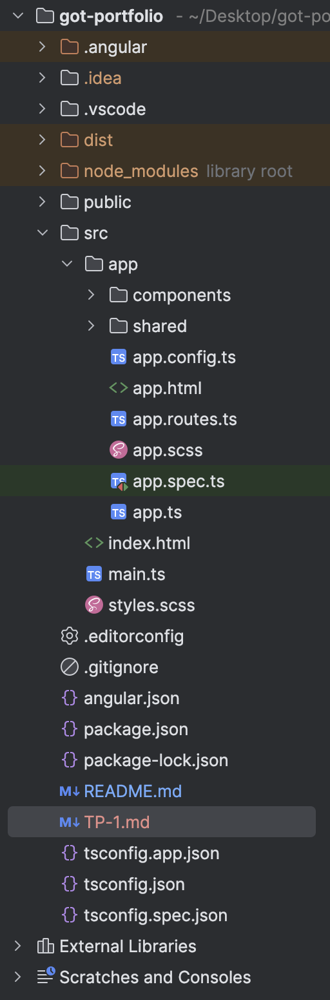

# 🧙 Commandes de base

- Création d'un projet Angular :  `ng new <my-app>`
- Voir ce que nous permet de faire l'Angular CLI : `ng --help`
- Lançement du serveur : `ng serve`
- Génération d'un composant : `ng generate component <component-name>` ou `ng g c <component-name>`
- Génération d'un service : `ng generate service <service-name>` ou `ng g s <service-name>`
- Génération d'une pipe : `ng generate pipe <pipe-name>` ou `ng g p <pipe-name>`
- Génération d'une directive : `ng generate directive <directive-name>` ou `ng g d <directive-name>`
- Générer l'application en mode production : `ng build`
- Appeler le script pour les tests : `ng test`

# 🎨 Les décorateurs

- `@Component` pour les composants
- `@Input` pour la transmission de données entre le parent et son enfant.
- `@Output` pour la transmission de données entre l'enfant et son parent.
- `@HostBinding` pour appliquer un style ou autre sans passer par un fichier de style.
- `@HostListener` pour appliquer un eventListener dans le DOM sans passer par du ts.
- `@Pipe` pour créer une pipe personnalisée.
- `@Directive` pour créer une directive personnalisée.

# 🎁 Outils Angular

- `ActivatedRoute` pour accéder aux données de la route active.
- `Router` pour naviguer vers une autre URL.
- `HttpClient` pour faire des call Http vers des APIs.
- `ElementRef` pour accéder aux éléments HTML du DOM.
- `Renderer2` pour appliquer du style (entre autre) aux éléments du DOM **the Angular way**.

Utiliser `inject()` pour les utiliser au sein de vos composants, services etc...

# 🏠 Architecture

Voir notre architecture

# 🔥 Concepts RxJs

- Observable - [RxJs - Observable](https://rxjs.dev/guide/observable)
- Subscription - [RxJs - Subscribe](https://rxjs.dev/guide/subscription)
- Tout RxJs - [RxJs - Tout](https://rxjs.dev/)

# ⚙️ Fonctionnement de notre site

## Homepage

- Liste de tous les personnages.
- De ces personnages , on affiche toutes leurs propriétés.
- Une barre de recherche présente pour filtrer nos personnages.

## Cities

- Affiche toutes nos données depuis la route active pour les afficher.
- Formulaire présent pour ajouter une nouvelle ville.
- Directive pour mettre un highlight au hover sur le nom de la ville survolée.

Base URL pour notre API : https://thronesapi.com/api/v2
**Routes disponibles**
  - `/Characters` - GET - Liste de tous les personnages.
  - `/Continents` - GET - Liste de tous les continents.

# 🧪 Les TP's

1. Allez au fichier [TP-1.md](TP-1.md)
2. Allez au fichier [TP-2.md](TP-2.md)
3. Allez au fichier [TP-3.md](TP-3.md)
